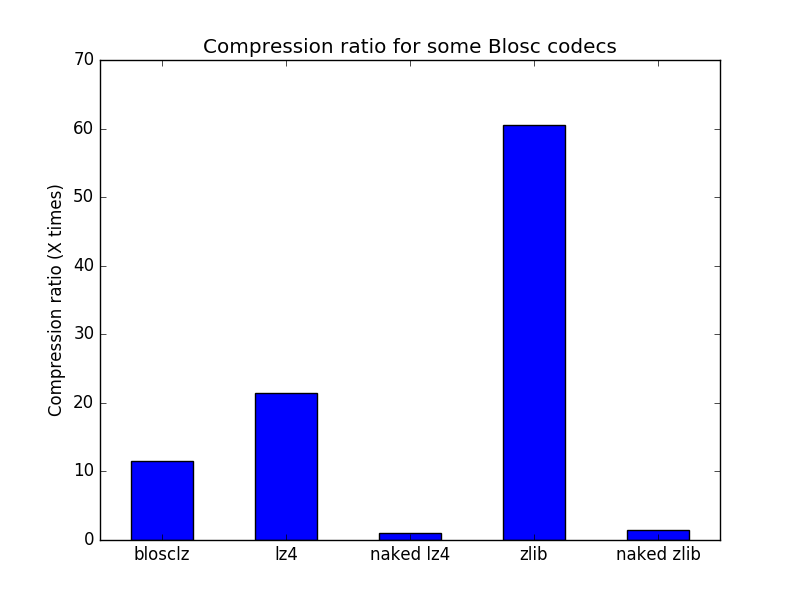
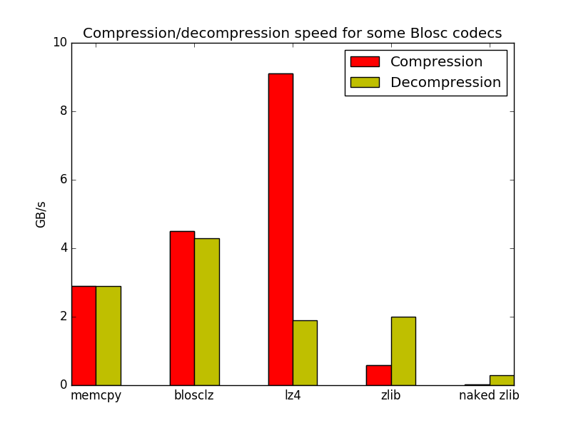

---------
Tutorials
---------

Using `python-blosc` (or just `blosc`, because we are going to talk always on
how to use it in a Python environment) is pretty easy.  It basically mimics
the API of the `zlib` module included in the standard Python library.

Here are some examples on how to use it.  For the full documentation, please
refer to the :ref:`reference` section.

Most of the times in this tutorial have been obtained using a VM with 2 cores
on top of a Intel(R) Core(TM) i5-3380M CPU @ 2.90GHz.

Compressing and decompressing with `blosc`
==========================================

Let's start creating a NumPy array with 80 MB full of data::

  >>> import numpy as np
  >>> a = np.linspace(0, 100, 1e7)
  >>> bytes_array = a.tostring()  # get an array of bytes

and let's compare Blosc operation with `zlib` (please note that we are
using IPython for leveraging its timing capabilities)::

  >>> import zlib
  >>> %timeit zlib.compress(bytes_array)
  1 loops, best of 3: 4.65 s per loop   # ~ 17 MB/s
  >>> import blosc
  >>> %timeit blosc.compress(bytes_array, typesize=8)
  100 loops, best of 3: 17.7 ms per loop # ~ 4.5 GB/s and 260x faster than zlib

but Blosc can use different codecs under the hood. Let's try the LZ4 codec
(instead of the BloscLZ which is the default)::

  >>> %timeit blosc.compress(bytes_array, typesize=8, cname='lz4')
  100 loops, best of 3: 8.77 ms per loop  # ~ 9.1 GB/s and 530x faster than zlib

It is important to note that this is quite more than the speed of a memcpy()
in this machine::

  >>> %timeit a.copy()
  10 loops, best of 3: 27.2 ms per loop  # ~ 2.9 GB/s

which means that both BloscLZ and LZ4 codecs can be faster than memcpy(),
just as the Blosc slogan promises.

Blosc also comes with the ZLib codec too, and it actually runs faster than
the naked zlib::

  >>> %timeit blosc.compress(bytes_array, typesize=8, cname='zlib')
  10 loops, best of 3: 139 ms per loop  # ~ 580 MB/s and 33x faster than zlib

The reason why the internal Zlib codec in Blosc is faster than the 'naked'
one is 1) that Blosc can use multithreading (using 8 threads here) and 2)
that Blosc splits the data to compress in smaller blocks that are more
friendly to the caches in modern CPUs.

Now, let's have a look at the compression ratios::

  >>> zpacked = zlib.compress(bytes_array); len(zpacked)
  52994692
  >>> round(len(bytes_array) / float(len(zpacked)), 3)
  1.51     # zlib achieves a 1.5x compression ratio

  >>> blzpacked = blosc.compress(bytes_array, typesize=8, cname='blosclz'); len(blzpacked)
  6986533
  >>> round(len(bytes_array) / float(len(blzpacked)), 3)
  11.451   # BloscLZ codec reaches more than 11x compression ratio

  >>> lz4packed = blosc.compress(bytes_array, typesize=8, cname='lz4'); len(lz4packed)
  3716015
  >>> round(len(bytes_array) / float(len(lz4packed)), 3)
  21.528   # LZ4 codec reaches more than 21x compression ratio

Here we can see how Blosc, with its different codecs, is very efficient
compressing this kind of binary data. It is important to note that the
codecs alone are not the only responsible for high compression ratios. See
what a naked LZ4 codec can do on the same string::

  >>> import lz4
  >>> lz4_packed = lz4.compress(bytes_array); len(lz4_packed)
  80309133
  >>> round(len(bytes_array) / float(len(lz4_packed)), 3)
  0.996

That is, the naked LZ4 codec cannot compress the array of bytes at all,
whereas through Blosc LZ4 can compress quite a lot. In fact, this difference
in compression also happens with ZLib::

  >>> zlibpacked = blosc.compress(bytes_array, typesize=8, cname='zlib'); len(zlibpacked)
  875274
  >>> round(len(zpacked) / float(len(zlibpacked)), 3)
  60.546   # ZLib codec reaches 60x more compression than naked ZLib

Here it is a plot with the different compression ratios achieved:

The explanation for this apparently shocking result is that Blosc uses
filters (`SHUFFLE` and `BITSHUFFLE` currently, but the list can increase
more in the future) prior to the compression stage and these allow in
general for better compression ratios when using binary data.

How about decompression?::

  >>> %timeit zlib.decompress(zpacked)
  1 loops, best of 3: 275 ms per loop  # ~ 290 MB/s
  >>> %timeit blosc.decompress(blzpacked)
  100 loops, best of 3: 17.3 ms per loop  # ~ 4.3 GB/s and 16x faster than zlib
  >>> %timeit blosc.decompress(lz4packed)
  10 loops, best of 3: 41.9 ms per loop  # ~ 1.9 GB/s and 6.5x faster than zlib
  >>> %timeit blosc.decompress(zlibpacked)
  10 loops, best of 3: 40.7 ms per loop  # ~ 2.0 GB/S and 6.8x faster than zlib

Here we see a couple of things:

* All the internal codecs in Blosc are way faster than naked ZLib

* The fastest codec for decompressing here is BloscLZ (remember that LZ4 was
  the fastest for compression).

The next plot summarizes the speed benchmarks above:

These results should reinforce the idea that there is not a single codec
that wins in all areas (compression ratio, compression speed and
decompression speed) and each has its pro's and con's. It is up to the user
to choose whatever fits better to him (hint: there is no replacement for
experimentation).

Finally, here it is the way to discover all the internal codecs inside your
Blosc package::

  >>> blosc.cnames
  ['blosclz', 'lz4', 'lz4hc', 'snappy', 'zlib']

*Note*: the actual list of codecs may change depening on how you have
compiled the underlying C-Blosc library.

Using different filters
=======================

In the same way that you can use different codecs inside Blosc, you can use
different filters too (currently `SHUFFLE` and `BITSHUFLE`). These allow the
integrated compressors to compress more efficiently or not, depending on
your datasets.

Here it is an example using the `SHUFFLE` filter::

  >>> %time bpacked = blosc.compress(bytes_array, shuffle=blosc.SHUFFLE)
  CPU times: user 112 ms, sys: 4 ms, total: 116 ms
  Wall time: 29.9 ms
  >>> len(bpacked)
  6986533

Here there is another example using `BITSHUFFLE`::

  >>> %time bpacked = blosc.compress(bytes_array, shuffle=blosc.BITSHUFFLE)
  CPU times: user 120 ms, sys: 8 ms, total: 128 ms
  Wall time: 32.9 ms
  >>> len(bpacked)
  5942257     #  ~ 1.2x smaller than blosclz/shuffle

You can also deactivate filters completely with `NOSHUFFLE`::

  >>> %time bpacked = blosc.compress(bytes_array, shuffle=blosc.NOSHUFFLE)
  CPU times: user 416 ms, sys: 8 ms, total: 424 ms
  Wall time: 107 ms
  >>> len(bpacked)
  74323591    #  just a 7% of compression wrt the original buffer

So you have quite a bit of flexibility on choosing different codecs and
filters inside Blosc. Again, depending on the dataset you have and the
requeriments on performance, you may want to experiment a bit before
sticking with your preferred one.

Supporting the buffer interface
===============================

python-blosc supports compressing and decompressing from any bytes-like
object that supports the buffer-interface: this includes `buffer`,
`memoryview` and `bytearray`::

  >>> input_bytes = b"abcdefghijklmnopqrstuvwxyz"
  >>> blosc.compress(input_bytes, typesize=1)
  '\x02\x01\x03\x01\x1a\x00\x00\x00\x1a\x00\x00\x00*\x00\x00\x00abcdefghijklmnopqrstuvwxyz'
  >>> blosc.compress(memoryview(input_bytes), typesize=1)
  '\x02\x01\x03\x01\x1a\x00\x00\x00\x1a\x00\x00\x00*\x00\x00\x00abcdefghijklmnopqrstuvwxyz'
  >>> blosc.compress(bytearray(input_bytes), typesize=1)
  '\x02\x01\x03\x01\x1a\x00\x00\x00\x1a\x00\x00\x00*\x00\x00\x00abcdefghijklmnopqrstuvwxyz'
  >>> compressed = blosc.compress(input_bytes, typesize=1)
  >>> blosc.decompress(compressed)
  'abcdefghijklmnopqrstuvwxyz'
  >>> blosc.decompress(memoryview(compressed))
  'abcdefghijklmnopqrstuvwxyz'
  >>> blosc.decompress(bytearray(compressed))
  'abcdefghijklmnopqrstuvwxyz'

Note however, that there are subtle differences between Python 2.x and 3.x.
For example, in Python 2.x we can compress/decompress both `str` and `unicode`
types, whereas in Python 3.x we can only compress 'binary' data which does
*not* include `unicode`.

Packaging NumPy arrays
======================

Want to use `blosc` to compress and decompress NumPy objects without having to
worry about passing the typesize for optimal compression, or having to create
the final container for decompression?  `blosc` comes with the `pack_array`
and `unpack_array` to perform this in a handy way::

  >>> a = np.linspace(0, 100, 1e7)
  >>> packed = blosc.pack_array(a)
  >>> %timeit blosc.pack_array(a)
  10 loops, best of 3: 104 ms per loop  # ~ 770 MB/s
  >>> %timeit blosc.unpack_array(packed)
  10 loops, best of 3: 76.3 ms per loop  # ~ 1 GB/s

Although this is a convenient way for compressing/decompressing NumPy
arrays, this method uses pickle/unpickle behind the scenes.  This step
implies additional copies, which takes both memory and time.

Compressing from a data pointer
===============================

For avoiding the data copy problem in the previous section, `blosc`
comes with a couple of lower-level functions: `compress_ptr` and
`decompress_ptr`.  Here are they in action::

  >>> c = blosc.compress_ptr(a.__array_interface__['data'][0], a.size, a.dtype.itemsize, 9, True)
  >>> %timeit blosc.compress_ptr(a.__array_interface__['data'][0], a.size, a.dtype.itemsize, 9, True)
  10 loops, best of 3: 17.8 ms per loop   # ~ 4.5 GB/s
  >>> a2 = np.empty(a.size, dtype=a.dtype)
  >>> %timeit blosc.decompress_ptr(c, a2.__array_interface__['data'][0])
  100 loops, best of 3: 11 ms per loop   #  ~ 7.3 GB/s
  >>> (a == a2).all()
  True

As you see, these are really low level functions because you should
pass actual pointers where the data is, as well as the size and
itemsize (for compression).  Needless to say, it is very easy to cause
a segfault by passing incorrect parameters to the functions (wrong
pointer or wrong size).

On the other hand, and contrarily to the `pack_array` / `unpack_array`
method, the `compress_ptr` / `decompress_ptr` functions do not need to
make internal copies of the data buffers, so they are extremely fast
(as much as the C-Blosc library can be), but you have to provide a
container when doing the de-serialization.
